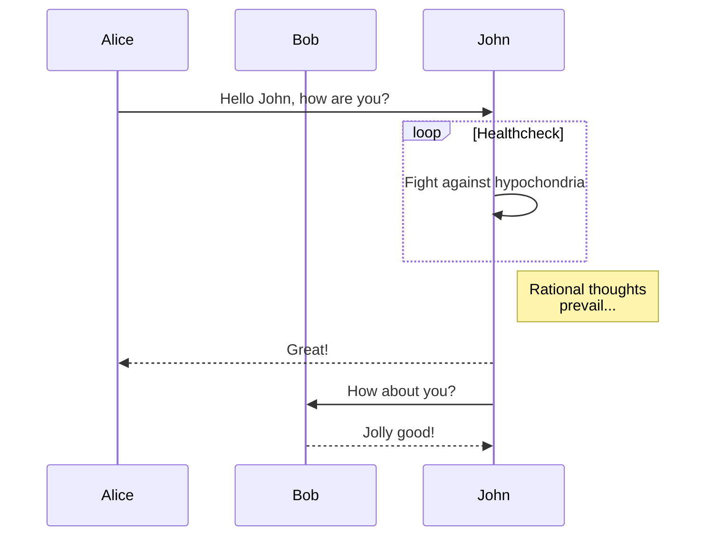

# group-assignment

## This is smaller heading

Here's a graph:

```mermaid
graph TD;
    A-->B;
    A-->C;
    B-->D;
    C-->D;
```

### an even smaller heading

Here's a sequence diagram:

```mermaid
sequenceDiagram
    participant Alice
    participant Bob
    Alice->>John: Hello John, how are you?
    loop Healthcheck
        John->>John: Fight against hypochondria
    end
    Note right of John: Rational thoughts <br/> prevail...
    John-->>Alice: Great!
    John->>Bob: How about you?
    Bob-->>John: Jolly good!
```