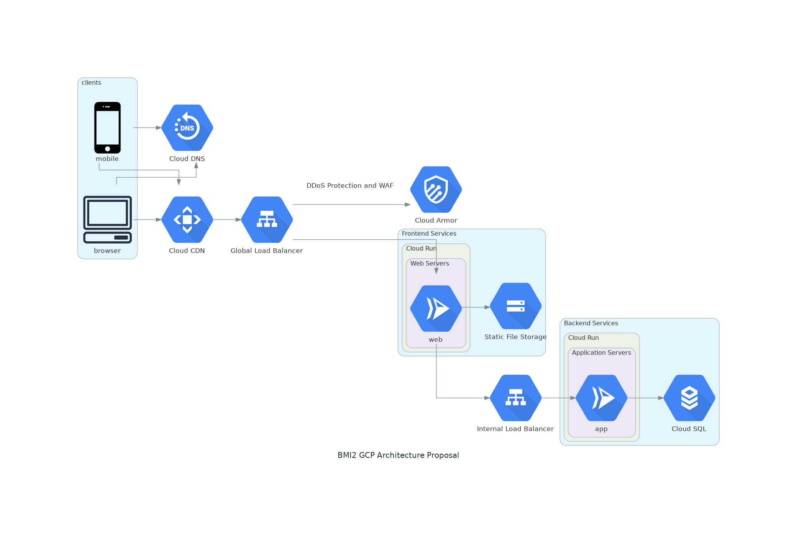

# group-assignment

## Infrastructure Diagram

Proposed Google Cloud Platform infrastructure, inspired by [13 Sample Architectures](https://cloud.google.com/blog/products/application-development/13-popular-application-architectures-for-google-cloud).

This is quite generic, and could easily be translated to an AWS or Azure option.

Note that any potential external services (IAM, payment) are not included in the diagram.

## This is smaller heading

Here's a graph:

### an even smaller heading

Here's a sequence diagram:

